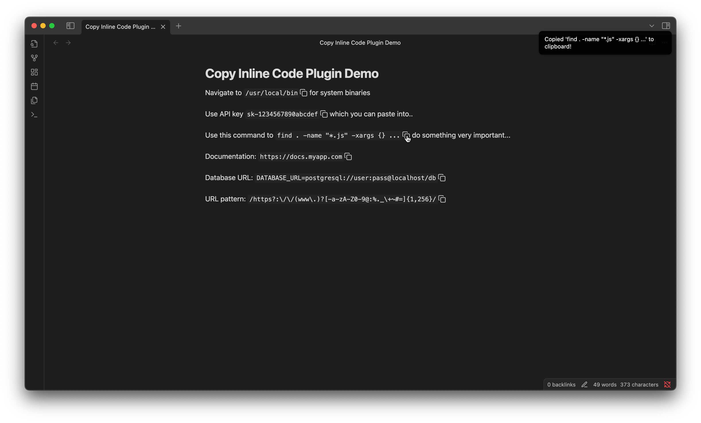

> This repository is an **improved COPY** of the original plugin with the following improvements:

## Changes in This Fork

- **No extra spacing on hover:** Enabling **Show on hover** no longer reserves space for hidden copy icons or changes line length or line height when they appear.
- **Clean printing and PDF export:** Copy icons are excluded from printed documents and exported PDFs.
- **Immediate settings:** Plugin settings apply to open editor and Reading Mode views without restarting Obsidian.
- **Configurable icon position:** Show either the Lucide or legacy copy icon on the right (default) or left in permanent and hover modes.

> It was created because original plugin has a lot of opened issues and **author doesn't respond**.

## 🔌 Installation via BRAT

You can install the latest beta version of this plugin using [Obsidian BRAT Plugin](https://community.obsidian.md/plugins/obsidian42-brat):

1. Open **Obsidian Settings** and go to **BRAT**.
2. Click **Add Beta plugin**.
3. Paste this repository URL: `https://github.com/vitovt/obsidian-copy-inline-code-plugin/`
4. Click **Add Plugin** and enable it under **Community plugins**.

---

# Obsidian Copy Inline Code Plugin

This plugin for [Obsidian](https://obsidian.md) adds a customizable icon inside each inline code, which when clicked, copies the content of the code into the clipboard. See screenshot of the functionality below.

## Installation
### Using built-in Obsidian plugin installer
From Obsidian v0.9.8, you can activate this plugin within Obsidian by doing the following:

- Open Settings > Third-party plugin
- Make sure Safe mode is off
- Click Browse community plugins
- Search for "Copy Inline Code"
- Click Install
- Once installed, close the community plugins window and activate the newly installed plugin

### Installing manually

- Download `main.js`, `styles.css`, `manifest.json` from the latest release
- Copy the files to your vault `[valut-folder]/.obsidian/plugins/copy-inline-code-plugin/`.

### Updates
You can follow the same procedure to update the plugin

## Development

- Clone this repo.
- Install Node.js 20 LTS or newer (the minimum supported version is 18.18).
- Run `npm ci` to install the exact versions in `package-lock.json`.
- Run `make dev` to compile continuously while developing.
- Run `make localbuild` to create a copy-ready plugin directory under `local-build/`.

Before committing, run `make check` to lint the TypeScript and plugin manifest and
to produce a strict production build. Dependency and install-script checks are
available through `npm audit --audit-level=low` and `npm install-scripts ls`.
